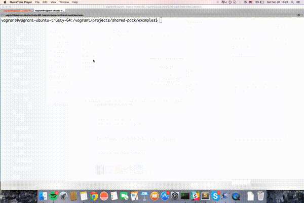

# shared-pack

Write code in [NodeJS](https://nodejs.org/en/)/[NPM](https://www.npmjs.com/), compile it for [AngularJS](https://angularjs.org/)/[bower](https://bower.io/).





# Index
 
* [`Requirements`](#requirements)
* [`Installation`](#installation)
* [`Usage`](#usage)

<a name="requirements" id="requirements"></a>
# Requirements

* npm
* node.js

<a name="installation" id="installation"></a>
# Installation

`npm install -g shared-pack`

<a name="usage"></a>
# Usage

1. [Create a node.js module](#createModule)
2. [Compile](#compile)
3. [Configure properly package.json and bower.json](#setMain)

<a name="createModule"></a>
## Create a javascript module

The module should satisfy the following 2 conditions:

1. it should be exposed as node.js module - using `module.exports`
2. the function to expose should be the angular.js function - with dependencies declared as parameters of the function

### Example

1. crete folder: `mkdir shared-module && cd $_`
2. initialize bower.json and package.json `bower init && npm init`
3. create module, example `shared-service.js`:
 	```
 	'use strict';

	function SharedService(param1) {
		console.log('Ola', param1);
	}

	module.exports = SharedService;
 	``` 

<a name="compile"></a>
## Compile

```
shared-pack ./shared-service.js
```

<a name="result"></a>
### Results

The results fo compilation will be a foldr `./build` containing 2 files

* `./build/shared-service.angular.js`

	```
	function SharedService(param1) {
		console.log('Ola', param1);
	}

	angular.module('SharedService', ['param1'])
		.factory('SharedService', ['param1', SharedService]);
	```


<a name="setMain"></a>
## Configure properly `main` field in bower.json and package.json

**bower.json**

```
	...
	"main":"./build/shared-service.angular.js",
	...
```


# Roadmap

* Add support for semantic versioning of bower: `shared-pack ./node-file.js patch|minor|major` changes field "version" in bower.json.
* Add support for private npm packages


